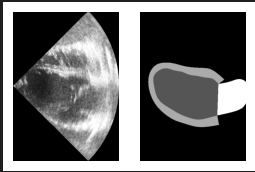
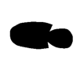
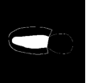
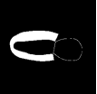
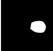
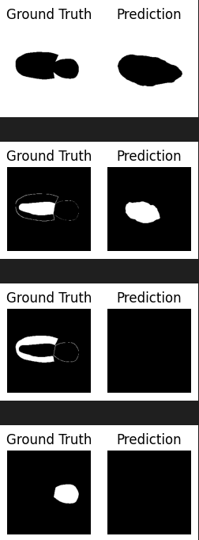
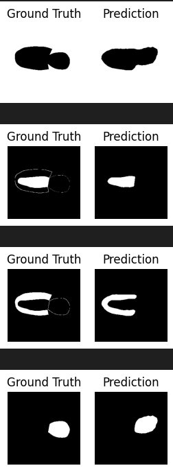
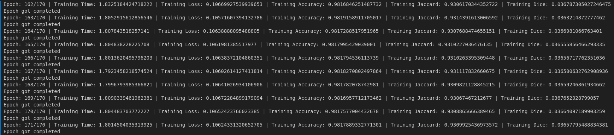
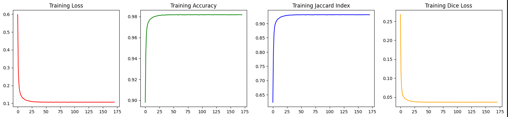
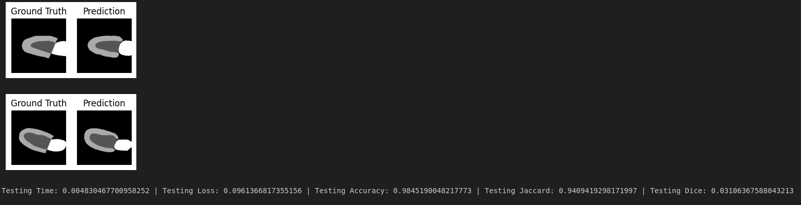

# Heart segmentation
In this project we have to basically segment 3 heart chambers that are left ventricular endocardium, left ventricular epicardium, Left atrium. 
## 1. Dataset Description
- we have used CAMUS DATASET (Cardiac acquisitions for multi-structure ultrasound segmentation).
- Total 500 patient data. Each patient is having 2 chamber and 4 chamber electrocardiography images during systole and diastole.
- Per person is having 4 images so we have total of 200 images which we have to segment.
- We have taken our input images using ultrasound and our input images consist of dimension 549x389x20 which we get from ultrasound and along with that we have ground truth that is single channel image which has different portions of hearts segmented.
- As shown below we have our input image on left hand side and our ground truth image on right side.
- The dataset fromat is nifti images which is used to store the medical images and we have extracted it using nibabel library which is used for thsi purpose.
- Further these images contain many information but we need info for only height and width and channels so for that we use lab.get_fdata function.
  
 

## 2. Model description

- We mostly use U-net for training our model but here we are using Deeplabv3 model which is little different from unet model and gives better accuracy.
- We first gives input to dataloader as one input image and one single channel ground truth and our custom dataloader returns the same input image and 4 different channel ground truth images which are segmented into 4 different classes that are background, left ventricular endocardium, left ventricular epicardium, Left atrium. Means our output ground truth images will have 4 channel image in which every channel is having the pixels of that particular class rest other are not present.
- so after spiltting our image into 4 channels we are getting output as shown below. This is our single ground truth which we spilitted into 4 different images. 

  
    

-  We have a batch size of 12 for training and batch size of 4 for testing. We also do transfrom in which we just reshape our image into a dimension of 256x256x20 and then convert the image into tensor.
- We spit our traning and testing data in 80:20 ratio i.e 1600 samples for training and 400 samples for testing.
- So finally in our deeplabv3 model our input image is going with a dimension of [12,1,256,256] and our model is giving segmented output with a dimension of [12, 4, 256, 256]. We are using resnet101 as our backbone model in deeplabv3.
- Next we are putting learning rate of 0.001 with stocastic gradient descent and used categorical cross entropy as our loss function and training it for 170 epochs. We are using lerning rate scheduler so that we can converge accordingly.
- Actually for segmentation we use categorical cross entropy along with dice loss but only categorical was giving us good results so we don't try other one.

## 3. Metrics

- To measure the performance of segmentation we mainly use Dice coefficient and IOU (intersection over union) also known as jacard index.
- We also used accuracy in our project and we measure accuracy by comparing pixel by pixel of ground and predicted channels divided by total no. of pixels in an images but it is not actually a good measure to tell the performance because let's say our actual segmented area is samll and our background is large and it shows the output  with some less or more dimensionality then also our accuracy will be high because of background.
- We use IOU which is perfect measure and its value is between 0-1. 1 shows perfect segmented output as input. IOU taken the intersection i.e common area of both the images and divided by the union of both the images __but here we don't consider background__.
- Dice coeff. = 1-dice loss.
- Dic coeff is also between 0 to 1 and 1 means perfect segmented image. Here we find dice coeff for 4 different areas and then we are taking the average

  ## 4. Training Results: Accuracy-98.17%, IOU-0.93
  Results with unet were: Accuracy-95%, IOU-0.90
  - Following are the results which we are getting after training for 170 epochs.
    
  - Left side are results after training after 1st epoch and right side are results after training for 170 epochs.
 
  

- Following are the training results for accuracy, loss, Jaccard, Dice value.

  
   

- Following are the training graphs for accuracy, loss, Jaccard, Dice value.

  

  

## 5. Testing Results: Accuracy-98.25%, IOU-0.94
  Results with unet were: Accuracy-95.4%, IOU-0.89
  
 - Following are the Testing results for accuracy, loss, Jaccard, Dice value.

  

   

